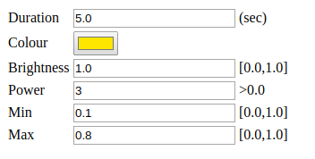

A Raspberry Pi command-line tool and service for glowing the Pimoroni Blinkt!

## Introduction

## Command Line

```$ ./glow.py --help
Usage: glow.py [OPTIONS]

Options:
  -r, --root TEXT          Root web folder
  -d, --duration FLOAT     Duration
  --min FLOAT              Minimum
  --max FLOAT              Maximum
  -b, --brightness FLOAT   Brightness
  -p, --power FLOAT        Power
  -c, --colour INTEGER...  Colour
  --stone                  Stone Mode
  --emerald                Emerald Mode
  --redstone               Redstone Mode
  --help                   Show this message and exit.
```

## Web User Interface

http://localhost:8080/



## Videos

[](https://www.youtube.com/watch?v=jpt5c_KMTl4)

[](https://www.youtube.com/watch?v=tUi1ILAl58A)

## Installation

### Ubuntu/Raspbian

`sudo apt install python-click python-webcolors python-bottle`

## Notes

How to disable the [LED lights](https://www.jeffgeerling.com/blogs/jeff-geerling/controlling-pwr-act-leds-raspberry-pi) on a Raspberry Pi.
